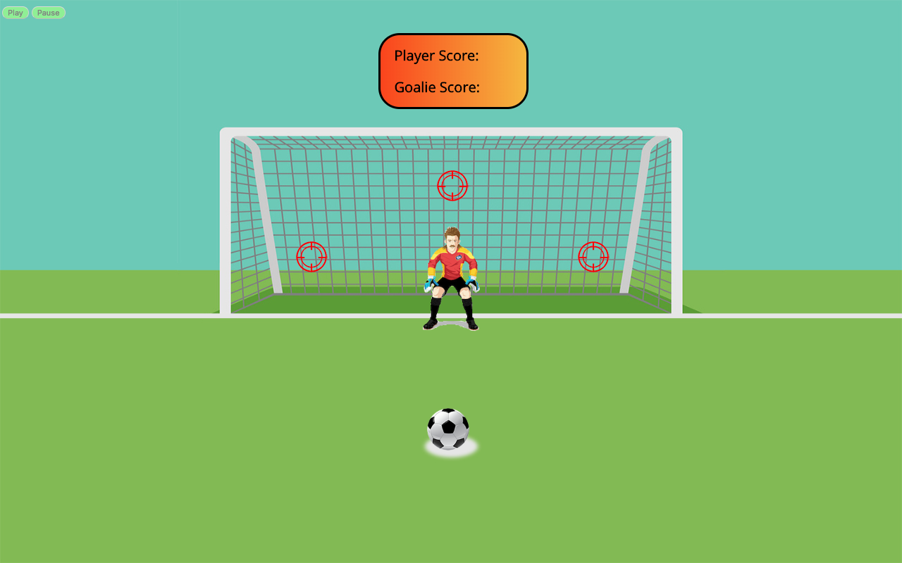
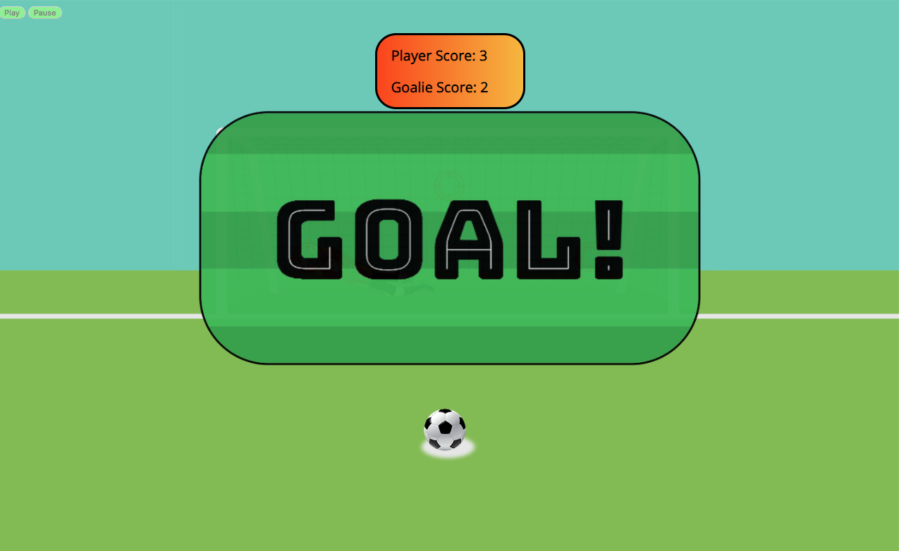
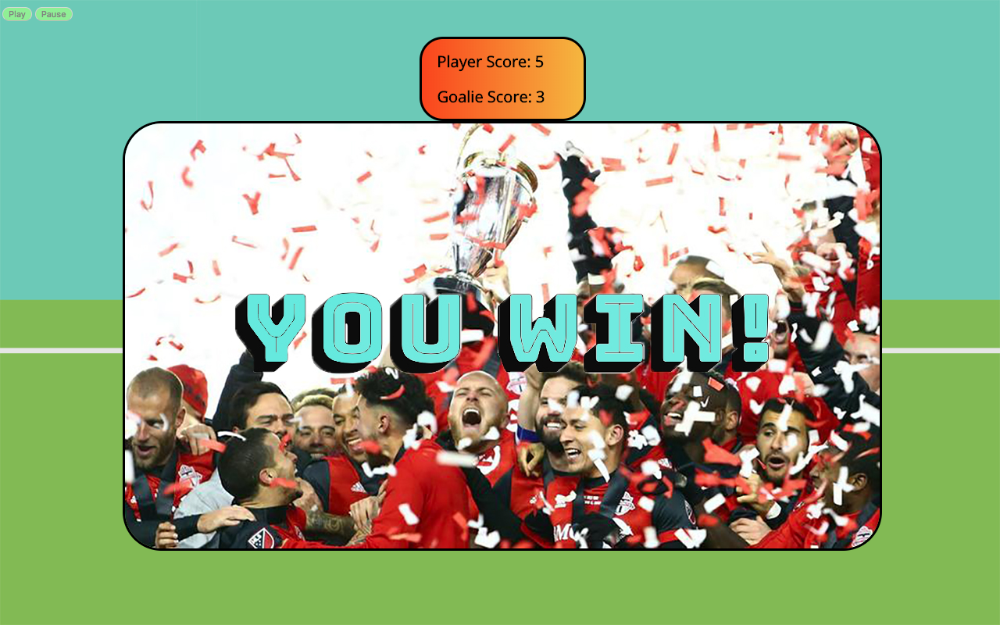

# BeatTheKeeper-Project_1-MHolzman

BEAT THE KEEPER

Live link: 

Technologies:
<ul>
	<li>HTML5</li>
	<li>CSS</li>
	<li>CSS Animations</li>
	<li>Vanilla JavaScript</li>
	<li>Adobe Photoshop</li>
</ul>

In competitive sports, it is rare to find such an important situation where there is a heavy reliance on luck rather than skill. This arcade game tries to mimic the odds the goalie and the shooter have of winning this duel. I chose to make 'Beat the Keeper' because of a life-long love of playing soccer. I have also always enjoyed playing sports related computer games growing up. I used photoshop to create the visuals and css to make the animations. Some roadblocks I encountered while creating the game included timing the animation of the ball, goalies dive, and goal screen so that they do not overlap. I would also like to give the user the ability to shoot to additional areas of the goal without unrealistically increasing the odds of the user winning, but I did not come to a solution to this dilemma. Lastly, a future upgrade would likely include better animation for the goalies dive, utilizing sprites and stopmotion. Hope you enjoy and good luck!

Screenshots:

Installation Instructions:

Fork this repository to your own account
Clone this file on to your machine

bibliography: 

`1. (Photo of celebration) http://www.chicagotribune.com/90minutes/mls/ct-90mins-mls-season-preview-toronto-fc-hope-for-repeat-of-title-winning-2017-story.html`

`2. (Images of goalie) http://picssr.com/photos/danielspreitzer?nsid=67729771@N04`

